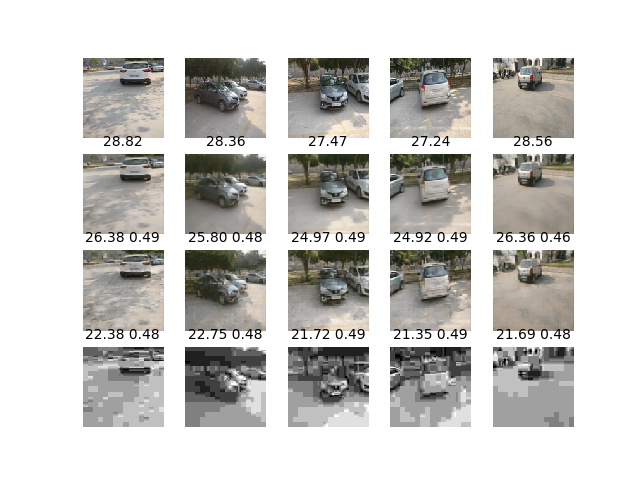
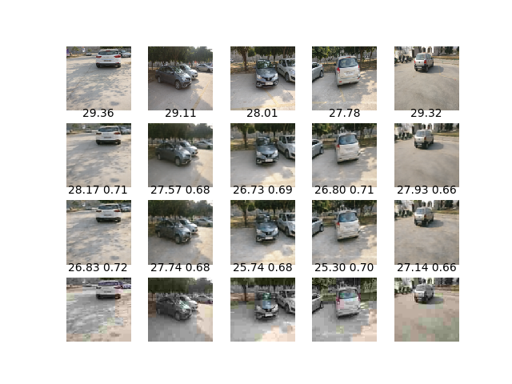

# Учебный проект, посвященный сжатию изображений при помощи нейронных сетей

## Пример работы

Результаты 100 эпох при квантовании 2

Результаты 100 эпох при квантовании 3

## Действия для запуска
    pyton -m venv venv
    venv/Scripts/activate
    pip install -r requirements.txt
    python EntropySetup.py build_ext --inplace
    python CNNImageCodec.py